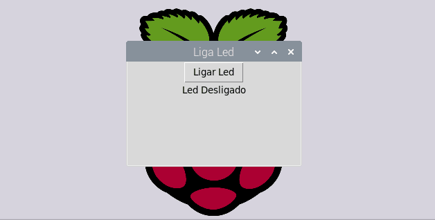

# LigaLedGUI

## Sobre

 O objetivo do projeto é ligar e desligar um led utilizando a interface gráfica criada em python com a biblioteca tkinter.

____

## Componentes

+ RaspberryPI;
+ Led;
+ Resistor 330Ω;
+ Jumpers;
+ Protoboard;

## Esquemático

___

## Softwares

+ Thonny;

___

## Como utilizar

+ Baixe o projeto no <b>RaspberryPI</b>;
+ Abra o projeto com o editor Thony;
+ Realize a montagem do circuito conforme mostrado no <b>Esquemático</b>, caso queira mudar o GPIO do led ou quiser colocar mais algum componente, veja a ordem de pinagem a seguir;

+ Clique no botão run e o projeto á executado;

___

 

Estou disponível para tirar qualquer dúvida do projeto 👍

    
   

